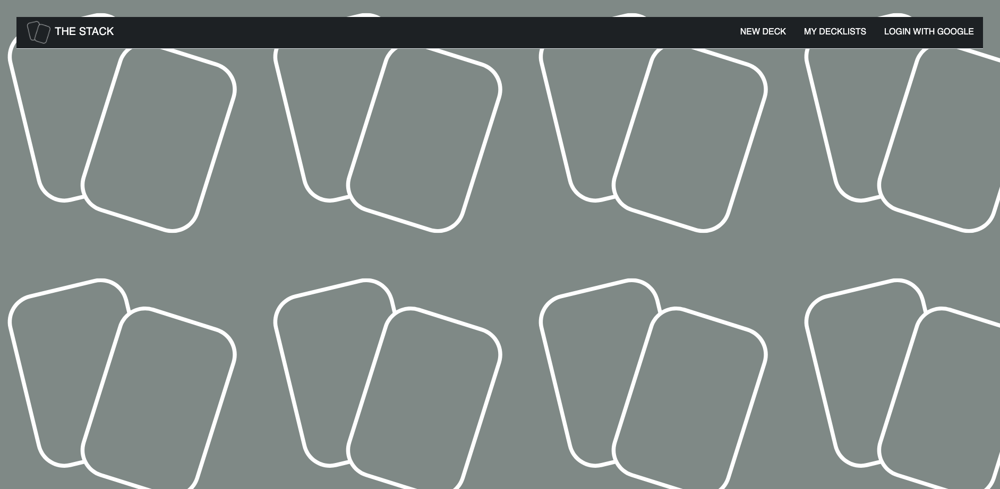
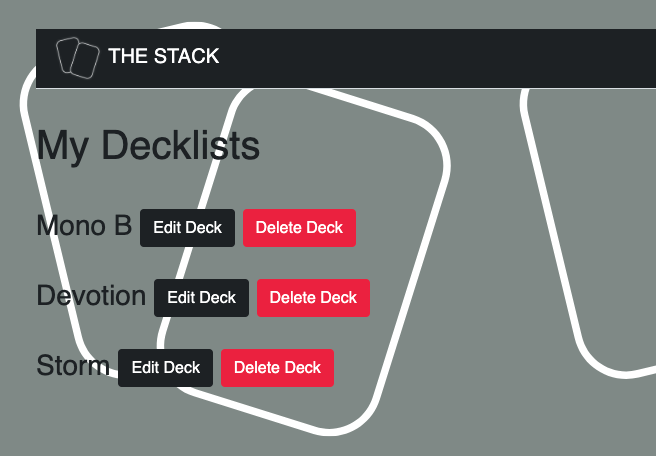
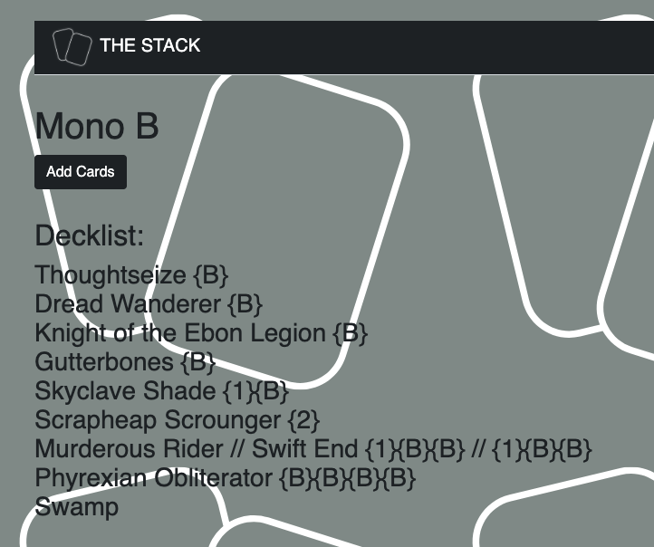
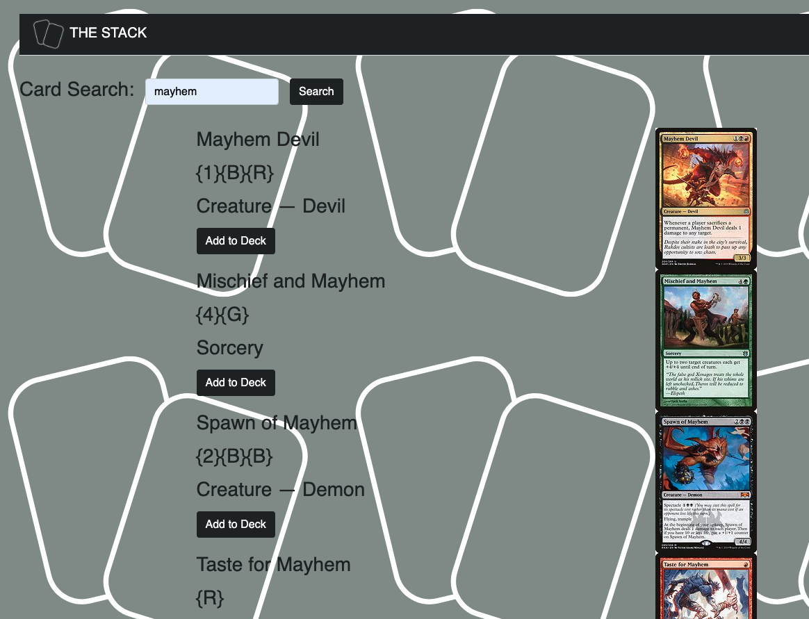

# The Stack
## Description
The Stack is a deckbuilder app for Magic the gathering. Simply use the search feature and add cards to your deck!

*Note original app was developed in an enterprise git repository.

## Getting Started
https://the-stack-mtg.herokuapp.com/

## Screenshots

## Technologies Used
* HTML
* CSS
* MongoDB
* Mongoose
* Express
* Node.js
* Scryfall API

## Future Enhancements
* Refined card searching
* More detailed decklist
* Social features like decklist sharing, ratings, and comments
